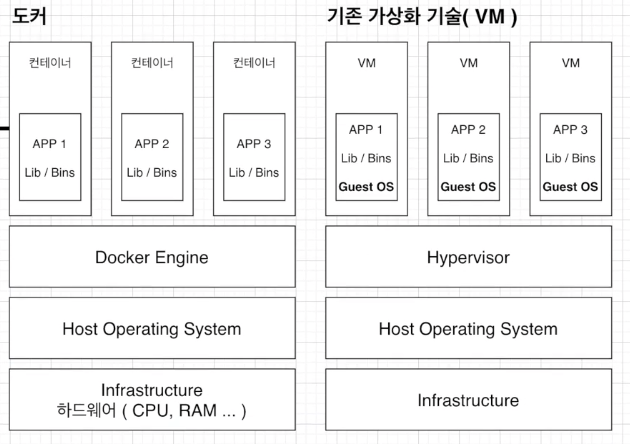
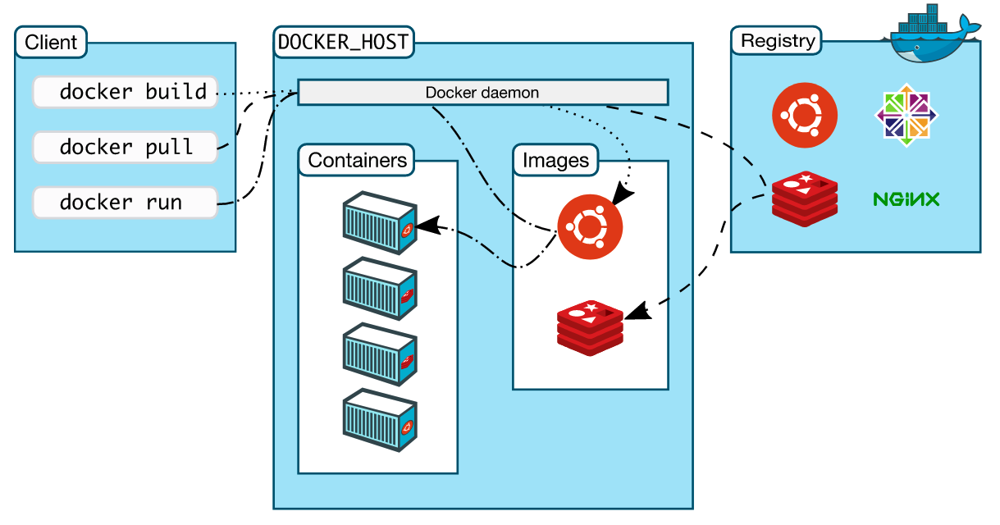
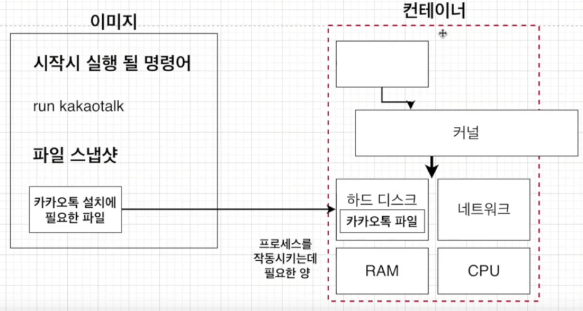

# Deocks 과제함

## VM과 Docker 구조 비교
### 하이퍼바이저 기반 VM 구조

### VM vs Docker 구조 비교

## Docker client / server 구조

- Docker daemon
- Docker client
- Docker registries
- Docker objects : images, containers, networks, volumes, plugins, and other objects.

## 도커 이미지
- 이미지는 응용 프로그램을 실행하는 데 필요한 모든 것을 포함하고 있다.
- 필요한 것? 2가지만 있으면 된다! <b>컨테이너가 시작될 때 실행되는 명령어 + 파일 스냅샷</b>

- Docker file: 도커 이미지를 생성하기 위해 간단한 syntax들을 이용하여 step들을 정의할 수 있는데, 그 step들이 정의된 스크립트가 Docker file이다. 

### 궁금한 점들
- Q. DockerFile에서 base image에 os 이미지를 넣는다. 그러면 guest os가 있는 것이 아닌가??
- A. https://www.linkedin.com/pulse/docker-host-os-guest-base-image-etc-abhijit-mazumder/
