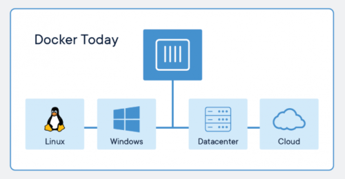
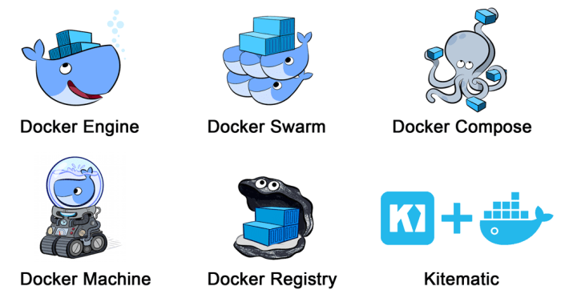
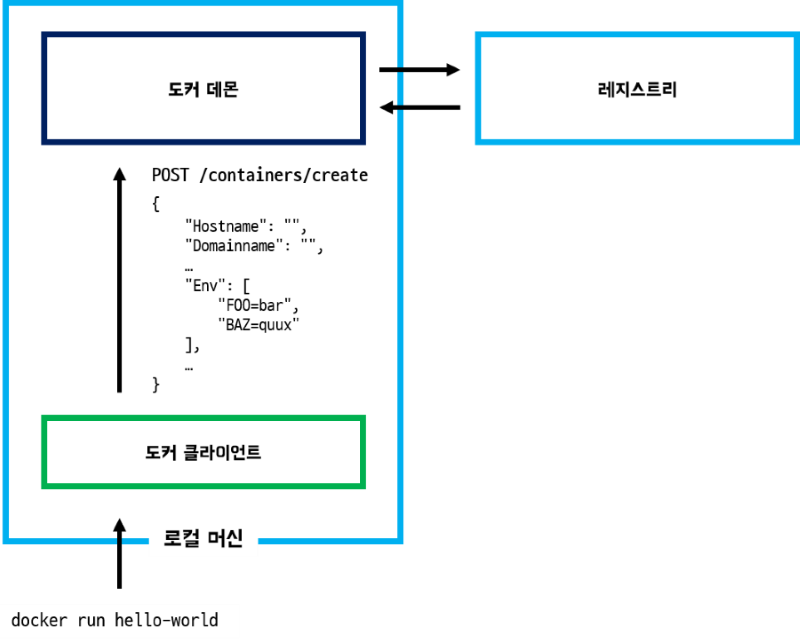
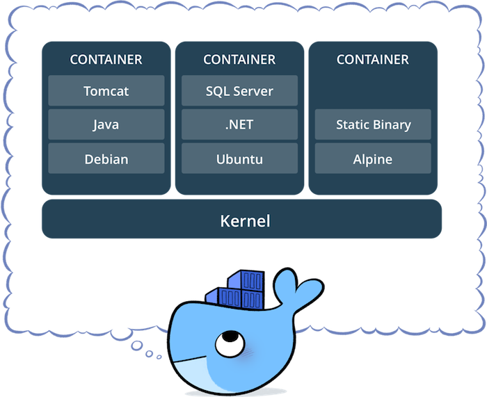
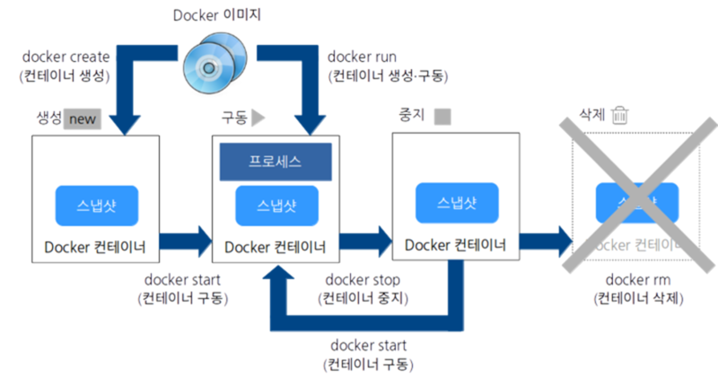
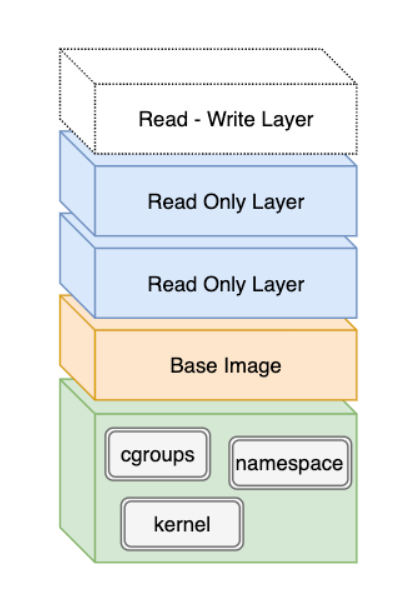
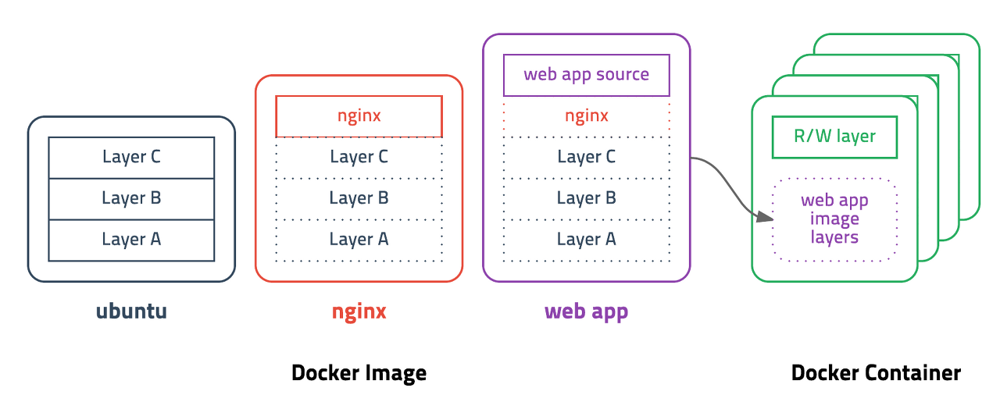

# 1. Docker의 기본 개념

## 1) Docker 란 무엇인가
- 도커Docker는 2013년에 등장한 컨테이너 기반 가상화 도구이다. 
- 도커는 리눅스 상에서 컨테이너 방식으로 프로세스를 격리해서 실행하고 관리할 수 있도록 도와주며, 계층화된 파일 시스템에 기반해 효율적으로 이미지(프로세스 실행 환경)을 구축할 수 있도록 해준다. 
- 컨테이너를 사용하여 응용 프로그램을 더 쉽게 만들고 배포하고 실행할 수 있도록 설계된 도구이다. 


## 2) Docker 를 왜 사용하는가
- __Infrastructure as Code__  
    인프라 구성 정보를 코드로 관리해두면 애플리케이션 개발 시 코드를 관리하는 것처럼 변경 이력을 일원화하여 관리할 수 있다.

- __이식성__  
    어디서든 동작하는 소프트웨어

- __상호운용성__  
    *Docker 컨테이너는 어디에나 있습니다.*  
    


## 3) 도커 컴포넌트


- __Docker Engine (핵심 기능)__  
Docker 이미지를 생성하고 컨테이너를 가동시키기 위한 Docker의 핵심 기능. Docker 명령의 실행이나 Dockerfile에 의한 이미지도 생성한다.

- __Docker Registry (이미지 공개 및 공유)__  
컨테이너의 바탕이 되는 Docker 이미지를 공개 및 공유하기 위한 레지스트리 기능. Docker의 공식 레지스트리 서비스인 Docker Hub도 이 Docker Registry를 사용한다.

- __Docker Compose (컨테이너 일원 관리)__  
여러 개의 컨테이너 구성 정보를 코드로 정의하고, 명령을 실행함으로써 애플리케이션의 실행 환경을 구성하는
컨테이너들을 일원 관리하기 위한 툴

- __Docker Machine (Docker 실행 환경 구축)__  
로컬 호스트용인 Virtual Box를 비롯하여 Amazone Web Services EC2나 Microsoft Azure와 같은 클라우드 환경에 Docker의 실행 환경을 명령으로 자동 생성하기 위한 툴

- __Docker Swarm (클러스터 관리)__  
Docker Swarm은 여러 Docker 호스트를 클러스터화하기 위한 툴. Docker Swarm에서는 클러스터를 관리하거나 API를 제공하는 역할은 Manager가, Docker 컨테이너를 실행하는 역할은 Node가 담당한다. 또한 오픈소스인 Kubernetes도 이용할 수 있다.


## 4) Docker Client-Server(Daemon)
### __Docker 통신방법__
- Docker는 데몬과 클라이언트 간의 통신을 할때 로컬에서는 유닉스 소켓을 사용하고, 원격에서는 TCP소켓을 사용한다. 
- HTTP REST 형식으로 API가 구현되어 있다. 
- 원격 레즈스트리에 통신하는 것도, 이미지들을 관리하는 것도, 접근하는 것도 핵심은 Host머신의 Daemon이다.

<br>


* __Docker client__  
    Docker 객체를 관리하고 실행하기 위해 Docker API를 사용히여 Deamon과 상호 작용한다. Docker 클라이언트는 둘 이상의 데몬과 통신 할 수 있다.

* __Docker Daemon__  
    Docker API 요청을 수신하고 이미지, 컨테이너, 네트워크 및 볼륨과 같은 Docker 객체를 관리한다. 데몬은 Docker 서비스를 관리하기 위해 다른 데몬과 통신 할 수도 있다.  

* __Dokcer Registry__  
    Docker 레지스트리 는 Docker 이미지를 저장힌다. Docker Hub는 누구나 사용할 수있는 공용 레지스트리이며 Docker는 기본적으로 Docker Hub에서 이미지를 찾도록 구성된다.
    
* __Dokcer objects__  
    Docker를 사용하면 이미지, 컨테이너, 네트워크, 볼륨, 플러그인 및 기타 객체를 만들고 사용한다.


## 5) 도커 명령어
- 클라이언트와 서버가 어떤 버전인지 어떤 API version 으로 통신하는지 확인한다.
```bash
$ docker version
```
- System Wide Information을 확인한다.
```bash
$ docker info
```


<br>


# 2. Docker 컨테이너

## 1) 컨테이너란 무엇인가
- 코드와 모든 종속성을 패키지화하여 응용 프로그램이 한 컴퓨터 환경에서 다른 컴퓨팅 환경으로 빠르고 안정적으로 실행되도록 하는 *__표준화 된 소프트웨어 단위__*  


<br>

## 2) 컨테이너와 가상 머신 비교

|VM|Container|
|----------|----------|
|OS 탑재, 부팅시 시간 소요 | 프로세스만 실행|
|커널과 라이브러리 등 포함 | 호스트 운영체제의 커널을 공유해서 사용. 리눅스 자체 기능인 chroot, namespace, cgroup 사용|
|용량이 크다 | 견량화되어 가볍다|
|가상화된 하드웨어 및 하이퍼바이저를 통해 처리 오버 헤드 필요 | 가상화 커널 공유 방식으로 각 컨테이너는 개별의 프로세스(오버헤드 x)|


## 3) 컨테이너 격리
- 컨테이너를 격리 시킬 수 있는 이유는 C group 과 네임스페이스를 이용하기 때문이다.
- Docker는 내부적으로 리눅스 VM 환경에서 돌아가고 리눅스 커널을 사용하고 있다.

  #### - __cgroup__  
  프로세스 및 thread를 그룹화하여 이를 관리하는 기능. OS의 CPU, 메모리와 같은 리소스를 그룹별로 제한할 수 있다. cgroup으로 컨테이너 내의 프로세스 리소스를 관리함으로써, 한 컨테이너가 같은 호스트 OS상에서 동작하는 다른 컨테이너에 영향을 주는 일을 막을 수 있다.

  #### - __namespace__
  네임스페이스는 동일한 시스템에서 별개의 독립된 공간을 격리된 환경에서 운영하는 가상화 기술이다. 

## 4) Docker Lifecycle

- Created : 생성되었지만 시작되지 않은 컨테이너  
    ```bash
    docker create
    ```
- Running : 모든 프로세스와 함께 실행되는 컨테이너  
    ```bash
    docker run      # 컨테이너 생성 후 즉시 실행 (create + start)
    docker start    # 중지된 컨테이너를 실행
    ```
- Paused : 프로세스가 일시 중지 된 컨테이너  
    ```bash
    docker pause 
    ```
- Stopped : 프로세스가 중지 된 컨테이너 
    ```bash
    docker stop     # SIGTERM(종료) 신호를 수신 한 뒤 SIGKILL(kill) 신호 수신
    docker kill     # 즉시 SIGKILL(kill) 수신
    ```
- Deleted : 죽은 상태의 컨테이너  
    ```bash
    docker rm
    ```

<br>

# 3. 도커 이미지와 Dockerfile

## 1) 도커 이미지

- Docker는 애플리케이션 실행에 필요한 프로그램, 라이브러리, 미들웨어와 OS, 네트워크 설정 등을 하나로 모아 Docker 이미지를 생성한다.
- Docker 이미지는 실행 환경에서 동작하는 컨테이너의 기반이 된다.
- Docker 이미지란 애플리케이션 실행에 필요한 파일이 담긴 디렉터리다. 
- Docker 커맨드를 사용하여 수동으로 만들 수 있으며  Dockerfile 프로그램을 통해 자동으로 생성할 수도 있다.
- Docker 이미지를 중첩하여 사용할 수 있다.
- Docker 이미지는  Docker 레지스트리에서 통합적으로 관리할 수 있다.

## 2) Dockerfile
- Docker는 코드로 인프라를 구성할 수 있는 기능을 제공하는데, 인프라 구성 방법을 저장해 둔 파일이 Dockerfile 이다.
- Dockerfile은 Docker 상에서 동작하는 컨테이너 구성 정보를 저장한 파일이다.
- Docker는 docker build 커맨드를 통해 Dockerfile에 저장된 구성 정보를 기반으로 Docker 이미지를 생성한다.
 
## 3) Docker 이미지 레이어 구조

- 레이어는 도커 이미지가 빌드될 때 Dockerfile에 정의된 명령문을 순서대로 실행하면서 만들어진다.  
(RUN, ADD, COPY 3가지 단계만 레이어로 저장되고, CMD, LABEL, ENV, EXPOSE 등과 같이 메타정보를 다루는 부분은 임시 레이어로 생성되지만 저장되지 않아 도커 이미지 사이즈에 영향을 주지 않는다.)
- 이 레이어들은 가각 독립적으로 저장되며 읽기 전용이기 때문에 임의로 수정할 수 없다.
- 도커 컨테이너가 실행되면 모든 읽기 전용 레이어를 순서대로 쌓은 다음 마지막에 쓰기 가능한 신규 레이어를 추가한다.
- 아무리 많은 도커 컨테이너를 실행하더라도 기존 읽기 전용 레이어는 변하지 않고, 컨테이너마다 생성된 쓰기 가능 레리어에 데이터가 쌓이기 때문에 서로 겹치지 않으며 컨테이너가 종료되면 모두 사라지게 된다.
- 도커 이미지 레이어가 중요한 이유는 이미 생성된 레이어는 캐시되어 재사용힐 수 있기 때문에 빌드 시간을 단축할 수 있다.  
(만약 Dockerfile에서 RUN, ADD, COPY 명령문이 수정되면 기존 캐시가 무효가 되고 새로운 레이어를 생성한다.)

<br>

# Reference
- 도커 개요
    - https://docs.docker.com/get-started/overview/
    - https://www.latera.kr/reference/etc/2019-12-14-docker-overview/#%EC%BB%A8%ED%85%8C%EC%9D%B4%EB%84%88-%ED%8F%AC%EB%A7%B7  


- 도커 기본 개념
    - https://eottabom.github.io/post/about-docker/


- Docker client와 Docker server
    - https://aidanbae.github.io/code/docker/docker-overview/


- Docker 컨테이너 라이프 사이클
    - https://racoonlotty.tistory.com/entry/Docker-%EC%BB%A8%ED%85%8C%EC%9D%B4%EB%84%88-%EB%9D%BC%EC%9D%B4%ED%94%84-%EC%82%AC%EC%9D%B4%ED%81%B4?category=730303
    - https://k21academy.com/docker-kubernetes/docker-container-lifecycle-management/

- Docker Layer
    - https://github.com/nginxinc/docker-nginx/blob/5c15613519a26c6adc244c24f814a95c786cfbc3/mainline/buster/Dockerfile