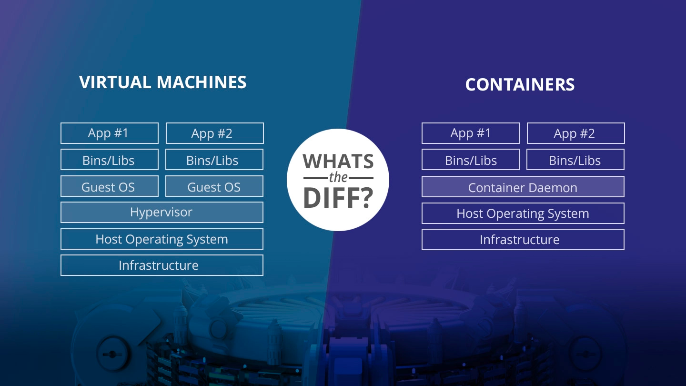
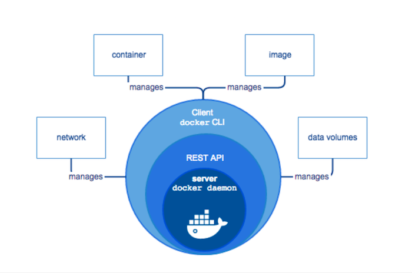

# Docker 1회차 과제

## 발표 주제들

아래 발표 주제들에 대하여 학습하고 싶은 데까지 자유롭게 학습하고, 자유로운 양식으로 발표를 준비해 봅시다. 그림을 그리며 순서와 흐름을 파악해 볼 것을 추천드립니다.

- 기존 VM와 도커 사이의 OS관점에서 구조적 차이
- 도커 client-server 구조
- 도커 이미지, Dockerfile

## 기존 VM과 도커 사이의 OS 관점에서 구조적 차이

- VM = Virtual Machine = 가상 머신 
    - 물리적 하드웨어 시스템에 구축되어 자체 CPU, 메모리, 네트워크 인터페이스 및 스토리지를 갖추고 
      가상 컴퓨터 시스템으로 작동하는 가상 환경이다.
    - 하이퍼바이저라 불리는 소프트웨어를 통해 가상 머신의 리소스를 분리하고 VM 에서 사용할 수 있도록 한다.
        - 하이퍼바이저는 할당되었던 리소스를 각 가상 머신에 제공하고, 물리 리소스에 대해 VM 리소스의 일정을 관리합니다. 물리적 하드웨어는 계속해서 실행 작업을 수행하므로 하이퍼바이저가 일정을 관리하는 동안 CPU가 VM에서 요청한 대로 CPU 명령을 계속 실행합니다.
    - 여러 운영체제를 하나의 호스트에서 생성할 수 있다. 
- Container 
    - 운영체제 수준의 가상화 기술로 OS를 공유하면서 프로세스를 격리된 환경에서 실행하는 기술
    - 가상 머신과 달리 커널을 공유하는 방식이기 때문에 실행 속도가 빠르고, 성능 상의 손실이 거의 없다. 
    - 실행된 프로세스는 커널을 공유하지만, namespace, cgroup, 루트 디렉터리 격리 등의 커널 기능을 활용해
      격리되어 실행된다.
    - 이러한 기술 덕분에 호스트 머신에게는 프로세스로 인식되지만, 컨테이너 관점에서는 마치 독립적인 환경을 가진 가상
      머신처럼 보인다. 
      

## 도커 client-server 구조

- Client 와 Server 로 나뉘어있고 REST API 로 통신한다.
    - 즉, 하나의 머신안에 존재할 필요 X
- Docker 데몬
    - 지속적으로 running 되면서 docker cli의 요청을 기다리고 docker 프로세스들을 관리한다.
    - Docker 데몬과 클라이언트 간 통신을 할 때 로컬에서는 유닉스 소켓을 사용하고, 원격에서는 TCP소켓을 사용한다.
    

## 도커 이미지, Dockerfile

- 도커 이미지
    - 컨테이너 실행에 필요한 파일과 설정값등을 포함하고 있는 것
    - 상태값을 가지지 않고 변하지 않는다. (Immutable, Snapshot)
- Dockerfile 
    - 컨테이너에 설치해야하는 패키지, 소스코드, 명령어, 환경변수설정 등을 기록한 하나의 파일.
    - DSL (domain-specific language) 언어를 사용하여 작성
    - 만약 서버에서 프로그램 실행을 위해 여러 의존성 패키지를 설치하고 설정파일을 만들었다면, 그 과정을 직접 진행하거나 메모장에 적어 관리하는 것이 아니라 Dockerfile로 관리하면 된다.

