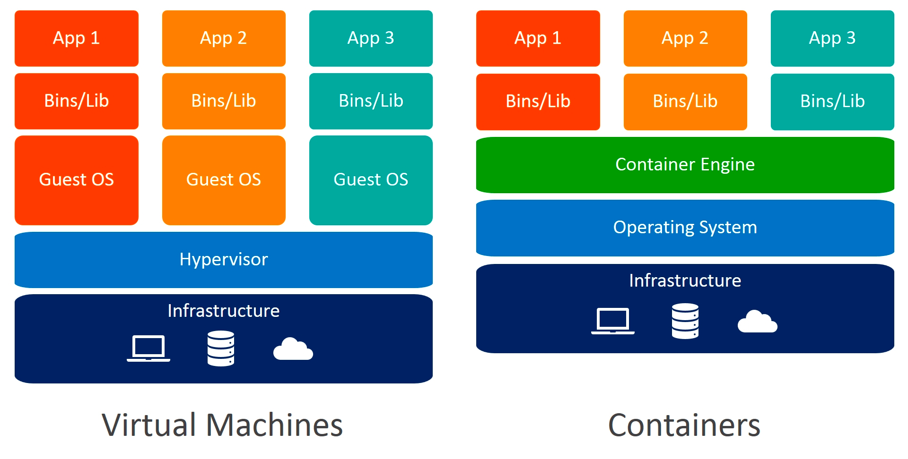
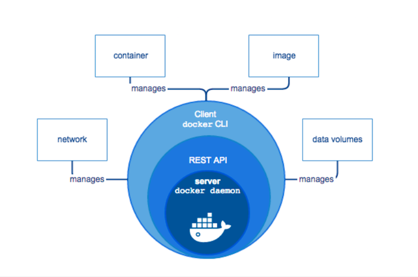

## 태헌 과제함

### 기존 VM와 도커 사이의 OS 관점에서 구조적 차이



기존 VM 기술은 하이퍼바이저에 의해 생성되고 관리되는 게스트 운영체제를 활용한다. 이때 시스템 자원을 가상화 하고 독립된 공간을
생성하기 위해 하이퍼바이저를 통해서 수행해야 하므로, 성능적으로 떨어진다. 또한 게스트 OS에 따라 필요한 라이브러리, 커널 등 
모두 포함해야 하기 때문에 이미지의 사이즈가 커진다. 반대로 도커의 컨테이너는 리눅스의 chroot, namespace, cgroup으로 
독립된 환경을 만들기에 하이퍼바이저를 통할 필요가 없다. 또한 컨테이너에 필요한 커널을 호스트와 공유하므로, 컨테이너 내 
필수적인 라이브러리나 실행 파일만 포함하므로 이미지의 사이즈가 작다.


### 도커 client-server 구조



도커는 도커 데몬(서버)와 도커 클라이언트로 나뉜다. 

#### 도커 클라이언트

도커 클라이언트는 사용자가 도커 데몬에 명령을 하는 역할이다. CLI로 명령어를 입력하면, 호스트 내의 도커 데몬의 경우 Unix
소켓을 통해 Dockerd API를 호출한다. 원격 호스트에 있는 경우에도 TCP를 통해 api 호출이 가능하다.

#### 도커 서버

도커 서버는 컨테이너 생성, 실행, 이미지 관리 등 도커 엔진을 통한 모든 작업을 수행한다.


### 도커 이미지, Dockerfile

#### 도커 이미지

모든 컨테이너는 이미지를 기반으로. apt-get 이나 brew 처럼 도커는 도커 허브에서 중앙 이미지 저장소에서 이미지를 받는다.

#### 이미지 구조

```bash
docker inspect ## 컨테이너, 네트워크, 볼륨, 이미지 등의 모든 도커 단위의 정보 확인 명령어
```


이미지를 커밋할 때, 컨테이너에서 변경사항만 새로운 레이어로 해쉬값을 저장한다. 따라서 레이어의 상위 이미지가 사용중이면, 하위 이미지는 삭제가 불가능하다.

#### Dockerfile

이미지 생성 방법

1. 도커 이미지 → 컨테이너 생성 → 애플리케이션 설치 → 커밋 = 새로운 이미지. → 번거롭다
2. 도커 이미지 → Dockerfile 빌드 → 새로운 이미지

매번 도커 이미지를 빌드하기 위해 컨테이너를 생성하여 애플리케이션을 설치하여 커밋하여 이미지를 만드는데, 굉장히 번거롭다. 
따라서 Dockerfile을 사용하여 이미지를 만드는데, 여기서 Dockerfile은 컨테이너에 필요한 패키지, 추가해야 하는 소스코드, 
명령어나 쉘 스크립트등을 기록한 파일이다.  

