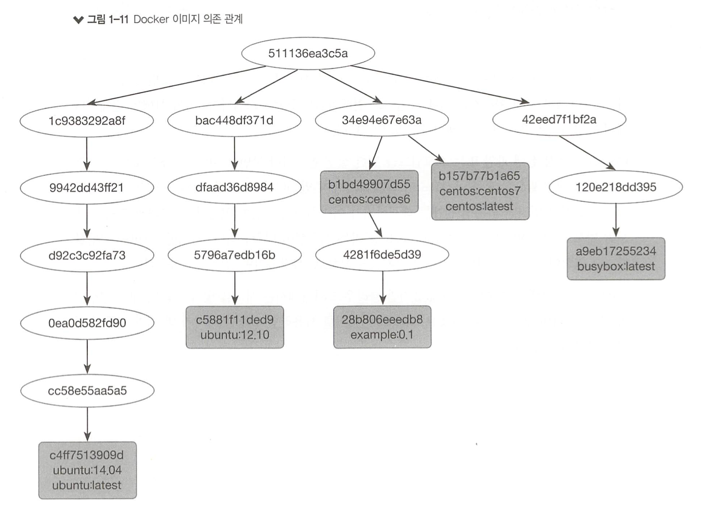

## 기존 VM와 도커 사이의 OS관점에서 구조적 차이

### 기존 VM

- 운영체제 위에서 가상화 소프트웨어를 사용해 하드웨어를 애뮬레이션해서 게스트 운영체제를 생성 ex) VMWare, VirtualBox
- 가상 머신은 물리적 호스트와 그 위에 설치되는 가상화 하이퍼바이저에서 작동


### 도커

- chroot와 LXC(cgroups, namespace)보다 성능 향상

- 게스트 OS를 설치하지 않고 이미지에 애플리케이션만 격리해서 설치
  - 호스트 OS와 실행 환경인 도커 엔진을 공유
  - 메모리 접근, 파일시스템, 네트워크 속도가 가상머신에 비해 월등히 빠르다. (호스트와 거의 동일)


## 도커 client-server 구조

- Docker Engine은 클라이언와 서버로 나누어져 있고 REST API로 소통
- 클라이언트는 요청만 하고 실질적인 작업은 서버(데몬)가 수행


### 도커 Client

- 도커 CLI

### 도커 Server(Daemon)

- 지속적으로 실행되면서 도커의 프로세스를 관리
- 다른 데몬과 통신
- 로컬에선 유닉스 소켓, 원격에선 TCP 소켓을 통해 클라이언트의 요청을 받아서 처리


## 도커 이미지, Dockerfile

### 도커 이미지

- Immutable Infrastructure의 구현체
  - 호스트 OS와 서비스 운영 환경(서버 프로그램, 소스코드, 컴파일된 바이너리)을 분리하고 한번 설정한 운영 환경은 변경하지 않는다는 개념
- 서비스 운영 환경을 이미지로 생성한 뒤 서버에 배포해 실행한다.
- 장점
  - 운영 환경을 이미지로 관리하기 때문에 체계적으로 배포를 관리할 수 있다.(VCS 사용)
  - 이미지를 통해 서버를 쉽게 확장할 수 있다. (Auto Scaling)
  - 로컬 환경에서 이미지를 실행하기만 하면 운영 환경과 동일한 환경을 구성할 수 있다.
  - OS와 운영 환경을 분리해서 가볍고 어디서든 실행 가능한 환경을 제공한다.
- 다른 이미지를 참조하는 방식으로 동작 (레이어)
  - 변경된 부분만 주고받기 때문에 가벼움




### Dockerfile

- 도커 이미지 설정파일로 Dockerfile을 기반으로 이미지를 생성

- Dockerfile 작성 -> `docker build`로 이미지 생성 -> `docker run`로 이미지 실행(컨테이너)

- `[명령] [매개변수]` 형식으로 작성하고, 각 명령은 독립적으로 실행

  ```dockerfile
  FROM scratch
  ```

- 명령은 항상 FROM으로 시작해야 함
  - 어떤 이미지를 기반으로 이미지를 생성할지 결정 (이미지는 참조하는 방식으로 동작)
  - 명시한 이미지가 로컬에 있으면 바로 참조하고 없으면 도커 허브에서 받아옴

- RUN에선 FROM에서 설정한 이미지 위에서 스크립트 또는 명령을 실행

