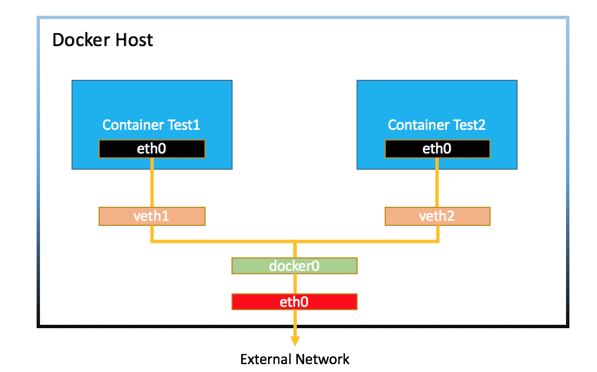
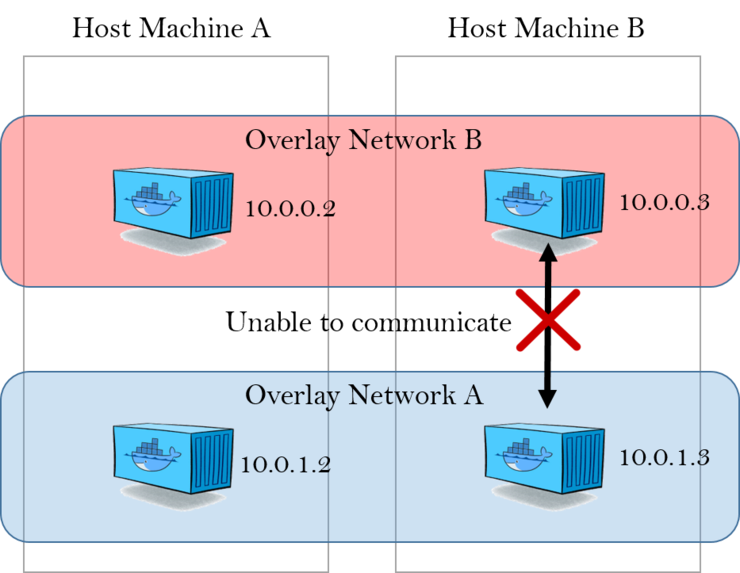

## 도커 네트워크 
### 컨테이너 외부 노출

컨테이너 생성시 컨테이너는 가상 IP 주소를 할당받는다. 172.17.0.x

아무 설정 없이 컨테이너는 컨테이너를 실행한 호스트에서만 접속가능하다. 외부에 컨테이너의 애플리케이션을 노출하기 위해서는 eth0의 ip와 port를 호스트의 ip와 port에 바인딩 해야한다.

docker run --link : 컨테이너 A 에서  컨테이너 B로 접근하는 방법중 간단한건 NAT 내부 IP. → IP가 유동적이므로 link 옵션을 통해 컨테이너 이름을 통해 접근하도록 해줌.(링크에 대한 컨테이너 없으면 실행 불가)

(해당 옵션은 deprecated 되어있고, 도커 브리지 네트워크를 사용하도록 권장하고 있다.)

도커 컨테이너에는 eth0(이더넷), lo(로컬 호스트) 네트워크 인터페이스 존재.

도커는 컨테이너에 순차적으로 내부 IP 부여. 외부와 ip연결을 위해 호스트에 veth 네트워크 인터페이스 생성한다.



mac os 는 docker0가 생성이 안됨. 가상의 네트워크를 생성하여 사용한다고 함. 


도커 컨테이너 생성시 docker0 브리지를 통해 외부와 통신. 사용자 선택에 따라 여러 네트워크 드라이버 사용 가능.

네트워크 드라이버 종류 : bridge, host, none, container, overlay..


### 브리지 네트워크

컨테이너 생성시 자동 연결되는 docker0 브리지를 활용한. 172.17.0.x 순차 할당.

docker0 아닌 사용자 정의 브리지 생성하여 컨테이너 연결하는 네트워크 구조.

브리지 네트워크는 connect, disconnect 로 유동적으로 연결, 연결해제가 가능.

서브넷, 게이트웨이, ip 할당범위까지 커스텀 가능.

### 호스트 네트워크

호스트의 네트워크 환경을 그대로쓸수 있음. 호스트 드라이버는 네트워크 별도 생성 없이 기존의 host 이름 사용. → 포트 포워딩 없이 사용 가능

### 논 네트워크

아무 네트워크 사용 안함. 외부(호스트)와의 연결 단절됨.

### 컨테이너 네트워크

다른 컨테이너의 네트워크 네임스페이스 환경 공유. 내부 ip를 새로 할당받지않고, veth또한 생성하지 않는다. 모든 네트워크 관련 사항이 공유 컨테이너와 동일해진다. 하나의 veth에 여러 컨테이너가 붙어있는 모습.

### net-alias

여러 컨테이너가 —net-alias 옵션으로 네트워크 별칭을 정할수 있고, 요청을 alias로 요청하면 라운드로빈 방식으로 요청을 보낸다. 즉. 도커 내장 dns  를 통해 요청한다.

도커 DNS 는 호스트 이름으로 컨테이너 IP 를 찾는다. —link 옵션으로 컨테이너 IP가 변경되어도 DNS 가 컨테이너 별명으로 조회한다.

브릿지 네트워크에서 alias 옵션또한 똑같이 동작한다. 라운드로빈 방식 활용해서 요청한다.

### MacVLAN 네트워크

호스트의 네트워크 인터페이스 카드를 가상화해 물리 네트워크 환경을 컨테이너에게 동일하게 제공. 컨테이너는 가상의 MAC 주소를 가지며, 해당 네트워크에 연결된 다른 장치와의 통신이 가능해진다.

동일한 IP 대역을 가지고 있는 컨테이너간 다른서버에 있더라도 통신이 가능해진다. 하지만 호스트와는 통신이 불가능하다.

docker network create

- -d : 네트워크 드라이버 선택
- —subnet: 서브네트워크 정보
- —ip-range: 컨테이너 ip 대역. 겹쳐서 생성하면 정상동작안하므로 주의.


### Overlay

overlay 네트워크는 여러 호스트에 분산되어 돌아가는 컨테이너들 간에 네트워킹을 위해서 사용된다.

- Overlay Network는 Docker Swarm에 참여하는 Docker Daemon간의 통신을 관리합니다.
- 독립실행형 Container의 Network를 생성하는 방법과 동일한 방식으로 Overlay Network를 생성할 수 있습니다.
- 기존에 생성된 Overlay Network에 Service를 연결시켜 Service간 통신을 활성화할 수 있습니다.
- Overlay Network는 Overlay Network Driver를 사용합니다.


### 서비스 디스커버리
Docker는 사용자가 정의한 Bridge, Overlay 및 MACVLAN Network들에게 Host 내의 모든 Container의 위치를 제공하는 내부 DNS Server를 갖고 있습니다. 각 Docker Container(또는 Docker Swarm의 Task)에 존재하는 DNS Resolver가, DNS 쿼리를 DNS Server 역할을 하는 Docker Engine으로 전달합니다. 그런 다음 Docker Engine은 DNS 쿼리가 요청한 Container가 Network 내에 포함되어있는지 확인합니다. Docker Engine은 key-value 저장소에서 Container, Task 또는 Service 이름과 일치하는 IP주소를 조회하고, 해당 IP 또는 Service Virtual IP(VIP)를 요청자에게 반환합니다. 이렇게 Docker는 내장 DNS를 사용하여, Single Docker Engine에서 실행되는 Container 및 Docker Swarm에서 실행되는 Task에 대한 Service Discovery기능을 제공합니다.

**서비스 디스커버리 & 로드 밸런싱**

* 서비스 디스커버리

- 컨테이너 스케줄링과 서비스 디스커버리는 동전의 양면

. 두 기능은 반드시 동행하며,

. 서로가 서로를 필요로 함

- 서비스 디스커버리란?

. 특정 컨테이너가 어느 host에서 실행되는지 알아내는 솔루션

. register 기능과 lookup 기능으로 구성

- 서비스 디스커버리는 로드 밸런싱과 밀접한 관계가 있다

- 100~1000+ node 규모의 클러스터라면 서비스 디스커버리 부하 테스트 필요

- 서비스 디스커버리 솔루션

. Zookeeper : 검증된 솔루션, 설치가 어렵다는 평

. etcd : 경량 솔루션

. Consul

. 기타 Mesos-DNS, SkyDNS, WeaveDNS 등

* 로드 밸런싱

- 로드 밸런싱으로 달성할 수 있는 것

. throughput 최대화, response time 최소화

. 특정 컨테이너에만 부하가 집중되는 것(hotspotting)을 방지

- 도커 로드 밸런싱 솔루션

. NGINX : 서비스 디스커버리 솔루션과 정합성 좋음

. HAProxy : 도커사가 솔루션을 인수, 향후 도커의 네이티브 솔루션이 될 전망

. Bamboo

. Kube-Proxy : k8s에 적용


Service Discovery는 Network 범위 내에서 동작합니다. 동일한 Network에 있는 Contrainer나 Task만 내장 DNS 기능을 사용할 수 있음을 의미합니다. 따라서, 동일한 Network에 있지 않은 Container는 서로의 주소를 확인할 수 없습니다. 또한, 특정 Network에 Container 또는 Task가 있는 Node만 해당 Network의 DNS 항목들을 저장합니다. 이러한 특징들이 Docker의 보안 및 성능을 향상시켜 줍니다. 만약 대상 Container 또는 Service가 원본 Container와 동일한 Network에 속하지 않는다면, Doker Engine은 구성된 기본 DNS Server로 DNS 쿼리를 전달합니다.

### 도커 컴포즈

여러 컨테이너로 하나의 애플리케이션을 동작할때 묶음으로 서비스 개발과 CI - 여러 컨테이너를 하나의 프로젝트로 다루도록 해줌.

각 컨테이너의 의존성, 네트워크, 볼륨 정의 및 컨테이너 수 조절 가능

docker-compose.yml →  컨테이너 생성.

- version

  도커 컴포즈 버전에 따른 yaml  버전

- 서비스 정의

  생성할 컨테이너 옵션들.

    - image: 컨테이너 생성에 필요한 이미지
    - links
    - environment
    - command
    - depends_on : 특정 컨테이너가 먼저 선행되어야 하는경우
    - ports
    - build: 도커파일에서 이미지를 빌드함. 해당경로의 도커파일로 빌드.
    - extends: 다른 야믈 파일의 서비스 속성을 상속받도록 한다.
- 네트워크 정의
    - driver :  기본 브릿지. 드라비러르 특정할 수 있음.
    - ipam : 서브넷, ip 버머위 설정.
    - external: 기존 네트워크를 사용하도록 설정.
- 볼륨 정의

### Pinpoint Docker Compose

- export, port 같이 선언하는 이유? 같은 network 간에도 expose 를 사용해야 하는가?  
- volume, port 를 콜론없이 하나만 사용하면 어떻게 구성되는걸까
- network 를 여러개 선언하면 어떻게 구성되는걸까


```bash
version: "3.6"

services:
  pinpoint-hbase:  # 서비스(컨테이너) 이름
    build: 
      context: ./pinpoint-hbase/ # ./pinpoint-hbase/Dockerfile 을 통해 이미지 빌드
      dockerfile: Dockerfile
      args:
        - PINPOINT_VERSION=${PINPOINT_VERSION}

    container_name: "${PINPOINT_HBASE_NAME}"  
    image: "pinpointdocker/pinpoint-hbase:${PINPOINT_VERSION}"
    networks:
      - pinpoint  # driver 정의 없으면 default bridge 네트워크

    volumes:
      - /home/pinpoint/hbase  # 도커 볼륨 생성
      - /home/pinpoint/zookeeper
    expose:  # 호스트에 포트를 공개하지 않고, 컨테이너에게만 포트 공개. 호스트 OS와는 직접 연결되지 않고, 도커 네트워크로 연결된 컨테이너 간 통신에 사용
      - "60000"
      - "16010"
      - "60020"
      - "16030"
    ports:    # 호스트 OS - 컨테이너 간 포트 바인딩
      - "60000:60000"
      - "16010:16010"
      - "60020:60020"
      - "16030:16030"
    restart: always  # 재시작 옵션
    depends_on:  # zoo1 컨테이너가 실행된 이후에 해당 컨테이너가 실행됨
      - zoo1

  pinpoint-mysql:
    build:
      context: ./pinpoint-mysql/
      dockerfile: Dockerfile
      args:
        - PINPOINT_VERSION=${PINPOINT_VERSION}
    
    container_name: pinpoint-mysql
    restart: always
    image: "pinpointdocker/pinpoint-mysql:${PINPOINT_VERSION}"
    hostname: pinpoint-mysql
    ports:
      - "3306:3306"
    environment:
      - MYSQL_ROOT_PASSWORD=${MYSQL_ROOT_PASSWORD}
      - MYSQL_USER=${MYSQL_USER}
      - MYSQL_PASSWORD=${MYSQL_PASSWORD}
      - MYSQL_DATABASE=${MYSQL_DATABASE}

    volumes:
      - mysql_data:/var/lib/mysql
    networks:
      - pinpoint

  pinpoint-web:
    build:
      context: ./pinpoint-web/
      dockerfile: Dockerfile
      args:
        - PINPOINT_VERSION=${PINPOINT_VERSION}

    container_name: "${PINPOINT_WEB_NAME}"
    image: "pinpointdocker/pinpoint-web:${PINPOINT_VERSION}"

    depends_on:
      - pinpoint-hbase
      - pinpoint-mysql
      - zoo1
    restart: always
    expose:
      - "9997"
    ports:
      - "9997:9997"
      - "${SERVER_PORT:-8080}:${SERVER_PORT:-8080}"
    environment:
      - SERVER_PORT=${SERVER_PORT}
      - SPRING_PROFILES_ACTIVE=${SPRING_PROFILES},batch
      - PINPOINT_ZOOKEEPER_ADDRESS=${PINPOINT_ZOOKEEPER_ADDRESS}
      - CLUSTER_ENABLE=${CLUSTER_ENABLE}
      - ADMIN_PASSWORD=${ADMIN_PASSWORD}
      - CONFIG_SENDUSAGE=${CONFIG_SENDUSAGE}
      - LOGGING_LEVEL_ROOT=${WEB_LOGGING_LEVEL_ROOT}
      - CONFIG_SHOW_APPLICATIONSTAT=${CONFIG_SHOW_APPLICATIONSTAT}
      - BATCH_ENABLE=${BATCH_ENABLE}
      - BATCH_SERVER_IP=${BATCH_SERVER_IP}
      - BATCH_FLINK_SERVER=${BATCH_FLINK_SERVER}
      - JDBC_DRIVERCLASSNAME=${JDBC_DRIVERCLASSNAME}
      - JDBC_URL=${JDBC_URL}
      - JDBC_USERNAME=${JDBC_USERNAME}
      - JDBC_PASSWORD=${JDBC_PASSWORD}
      - ALARM_MAIL_SERVER_URL=${ALARM_MAIL_SERVER_URL}
      - ALARM_MAIL_SERVER_PORT=${ALARM_MAIL_SERVER_PORT}
      - ALARM_MAIL_SERVER_USERNAME=${ALARM_MAIL_SERVER_USERNAME}
      - ALARM_MAIL_SERVER_PASSWORD=${ALARM_MAIL_SERVER_PASSWORD}
      - ALARM_MAIL_SENDER_ADDRESS=${ALARM_MAIL_SENDER_ADDRESS}
      - ALARM_MAIL_TRANSPORT_PROTOCOL=${ALARM_MAIL_TRANSPORT_PROTOCOL}
      - ALARM_MAIL_SMTP_PORT=${ALARM_MAIL_SMTP_PORT}
      - ALARM_MAIL_SMTP_AUTH=${ALARM_MAIL_SMTP_AUTH}
      - ALARM_MAIL_SMTP_STARTTLS_ENABLE=${ALARM_MAIL_SMTP_STARTTLS_ENABLE}
      - ALARM_MAIL_SMTP_STARTTLS_REQUIRED=${ALARM_MAIL_SMTP_STARTTLS_REQUIRED}
      - ALARM_MAIL_DEBUG=${ALARM_MAIL_DEBUG}
    links:
      - "pinpoint-mysql:pinpoint-mysql"
    networks:
      - pinpoint

  pinpoint-collector:
    build:
      context: ./pinpoint-collector/
      dockerfile: Dockerfile
      args:
        - PINPOINT_VERSION=${PINPOINT_VERSION}

    container_name: "${PINPOINT_COLLECTOR_NAME}"
    image: "pinpointdocker/pinpoint-collector:${PINPOINT_VERSION}"

    depends_on:
      - pinpoint-hbase
      - zoo1
    restart: always
    expose:
      - "9991"
      - "9992"
      - "9993"
      - "9994"
      - "9995"
      - "9996"
    ports:
      - "${COLLECTOR_RECEIVER_GRPC_AGENT_PORT:-9991}:9991/tcp"
      - "${COLLECTOR_RECEIVER_GRPC_STAT_PORT:-9992}:9992/tcp"
      - "${COLLECTOR_RECEIVER_GRPC_SPAN_PORT:-9993}:9993/tcp"
      - "${COLLECTOR_RECEIVER_BASE_PORT:-9994}:9994"
      - "${COLLECTOR_RECEIVER_STAT_UDP_PORT:-9995}:9995/tcp"
      - "${COLLECTOR_RECEIVER_SPAN_UDP_PORT:-9996}:9996/tcp"
      - "${COLLECTOR_RECEIVER_STAT_UDP_PORT:-9995}:9995/udp"
      - "${COLLECTOR_RECEIVER_SPAN_UDP_PORT:-9996}:9996/udp"

    networks:
      - pinpoint
    environment:
      - SPRING_PROFILES_ACTIVE=${SPRING_PROFILES}
      - PINPOINT_ZOOKEEPER_ADDRESS=${PINPOINT_ZOOKEEPER_ADDRESS}
      - CLUSTER_ENABLE=${CLUSTER_ENABLE}
      - LOGGING_LEVEL_ROOT=${COLLECTOR_LOGGING_LEVEL_ROOT}
      - FLINK_CLUSTER_ENABLE=${FLINK_CLUSTER_ENABLE}
      - FLINK_CLUSTER_ZOOKEEPER_ADDRESS=${FLINK_CLUSTER_ZOOKEEPER_ADDRESS}

  pinpoint-quickstart:
    build:
      context: ./pinpoint-quickstart/
      dockerfile: Dockerfile

    container_name: "pinpoint-quickstart"
    image: "pinpointdocker/pinpoint-quickstart"
    ports:
      - "${APP_PORT:-8080}:8080"
    volumes:
      - data-volume:/pinpoint-agent
    environment:
      JAVA_OPTS: "-javaagent:/pinpoint-agent/pinpoint-bootstrap-${PINPOINT_VERSION}.jar -Dpinpoint.agentId=${AGENT_ID} -Dpinpoint.applicationName=${APP_NAME} -Dpinpoint.profiler.profiles.active=${SPRING_PROFILES}"
    networks:
      - pinpoint
    depends_on:
      - pinpoint-agent

  pinpoint-agent:
    build:
      context: ./pinpoint-agent/
      dockerfile: Dockerfile
      args:
        - PINPOINT_VERSION=${PINPOINT_VERSION}

    container_name: "${PINPOINT_AGENT_NAME}"
    image: "pinpointdocker/pinpoint-agent:${PINPOINT_VERSION}"

    restart: unless-stopped

    networks:
      - pinpoint
    volumes:
      - data-volume:/pinpoint-agent
    environment:
      - SPRING_PROFILES=${SPRING_PROFILES}
      - COLLECTOR_IP=${COLLECTOR_IP}
      - PROFILER_TRANSPORT_AGENT_COLLECTOR_PORT=${PROFILER_TRANSPORT_AGENT_COLLECTOR_PORT}
      - PROFILER_TRANSPORT_METADATA_COLLECTOR_PORT=${PROFILER_TRANSPORT_METADATA_COLLECTOR_PORT}
      - PROFILER_TRANSPORT_STAT_COLLECTOR_PORT=${PROFILER_TRANSPORT_STAT_COLLECTOR_PORT}
      - PROFILER_TRANSPORT_SPAN_COLLECTOR_PORT=${PROFILER_TRANSPORT_SPAN_COLLECTOR_PORT}
      - PROFILER_SAMPLING_RATE=${PROFILER_SAMPLING_RATE}
      - DEBUG_LEVEL=${AGENT_DEBUG_LEVEL}
      - PROFILER_TRANSPORT_MODULE=${PROFILER_TRANSPORT_MODULE}
    depends_on:
      - pinpoint-collector

  #zookeepers
  zoo1:
    image: zookeeper:3.4
    restart: always
    hostname: zoo1
    expose:
      - "2181"
      - "2888"
      - "3888"
    ports:
      - "2181" # 호스트의 랜덤한 포트와 컨테이너의 포트를 매핑
    environment:
      ZOO_MY_ID: 1
      ZOO_SERVERS: server.1=0.0.0.0:2888:3888 server.2=zoo2:2888:3888 server.3=zoo3:2888:3888
    networks:
      - pinpoint

  zoo2:
    image: zookeeper:3.4
    restart: always
    hostname: zoo2
    expose:
      - "2181"
      - "2888"
      - "3888"
    ports:
      - "2181"
    environment:
      ZOO_MY_ID: 2
      ZOO_SERVERS: server.1=zoo1:2888:3888 server.2=0.0.0.0:2888:3888 server.3=zoo3:2888:3888
    networks:
      - pinpoint

  zoo3:
    image: zookeeper:3.4
    restart: always
    hostname: zoo3
    expose:
      - "2181"
      - "2888"
      - "3888"
    ports:
      - "2181"
    environment:
      ZOO_MY_ID: 3
      ZOO_SERVERS: server.1=zoo1:2888:3888 server.2=zoo2:2888:3888 server.3=0.0.0.0:2888:3888
    networks:
      - pinpoint

  ##flink
  jobmanager:
    build:
      context: pinpoint-flink
      dockerfile: Dockerfile
      args:
        - PINPOINT_VERSION=${PINPOINT_VERSION}

    container_name: "${PINPOINT_FLINK_NAME}-jobmanager"
    image: "pinpointdocker/pinpoint-flink:${PINPOINT_VERSION}"
    expose:
      - "6123"
    ports:
      - "${FLINK_WEB_PORT:-8081}:8081"
    command: standalone-job -p 1 pinpoint-flink-job.jar -spring.profiles.active release
    environment:
      - JOB_MANAGER_RPC_ADDRESS=jobmanager
      - PINPOINT_ZOOKEEPER_ADDRESS=${PINPOINT_ZOOKEEPER_ADDRESS}
    networks:
      - pinpoint
    depends_on:
      - zoo1

  taskmanager:
    build:
      context: pinpoint-flink
      dockerfile: Dockerfile
      args:
        - PINPOINT_VERSION=${PINPOINT_VERSION}

    container_name: "${PINPOINT_FLINK_NAME}-taskmanager"
    image: "pinpointdocker/pinpoint-flink:${PINPOINT_VERSION}"
    expose:
      - "6121"
      - "6122"
      - "19994"
    ports:
      - "6121:6121"
      - "6122:6122"
      - "19994:19994"
    depends_on:
      - zoo1
      - jobmanager
    command: taskmanager
    links:
      - "jobmanager:jobmanager"
    environment:
      - JOB_MANAGER_RPC_ADDRESS=jobmanager
    networks:
      - pinpoint

volumes:
  data-volume:
  mysql_data:

networks:
  pinpoint:
    driver: bridge  # 브릿지 네트워크
```

### Pinpoint hbase

```bash
version: "3.6"

services:
  pinpoint-hbase:
    build:
      context: .    # 도커파일 위치
      dockerfile: Dockerfile # 도커파일 이름
      args:
        - PINPOINT_VERSION=${PINPOINT_VERSION}

    container_name: "${PINPOINT_HBASE_NAME}"
    image: "pinpointdocker/pinpoint-hbase:${PINPOINT_VERSION}"

    volumes:
      - /home/pinpoint/hbase
      - /home/pinpoint/zookeeper
    expose:
#      # zookeeper
#      - "2181"
      # HBase Master API port
      - "60000"
      # HBase Master Web UI
      - "16010"
      # Regionserver API port
      - "60020"
      # HBase Regionserver web UI
      - "16030"
    ports:
      - "${EXTERNAL_HBASE_PORT:-2181}:2181"
      - "60000:60000"
      - "16010:16010"
      - "60020:60020"
      - "16030:16030"
    restart: always
```

```bash
version: '3.7'

volumes:
    prometheus_data: {}
    grafana_data: {}

networks: # 네트워크 정의
  front-tier:
  back-tier:

services:

  prometheus:
    image: prom/prometheus:v2.1.0
    volumes:
      - ./prometheus/:/etc/prometheus/  # host의 ./prometheus/ <-> container의 /etc/prometeus/
      - prometheus_data:/prometheus
    command:  # 실행시 명령어
      - '--config.file=/etc/prometheus/prometheus.yml'
      - '--storage.tsdb.path=/prometheus'
      - '--web.console.libraries=/usr/share/prometheus/console_libraries'
      - '--web.console.templates=/usr/share/prometheus/consoles'
    ports:
      - 9090:9090  # host의 9090 -> container의 9090
    links:  # 컨테이너 내에서 컨테이너 이름으로 ip 추적 (도커 dns 등록)
      - cadvisor:cadvisor   
      - alertmanager:alertmanager
#      - pushgateway:pushgateway
    depends_on:  # cadvisor 먼저 실행
      - cadvisor
#      - pushgateway
    networks:  # back-tier 브릿지 네트워크
      - back-tier
    restart: always
#    deploy:
#      placement:
#        constraints:
#          - node.hostname == ${HOSTNAME}

  node-exporter:
    image: prom/node-exporter
    volumes:
      - /proc:/host/proc:ro
      - /sys:/host/sys:ro
      - /:/rootfs:ro
    command: 
      - '--path.procfs=/host/proc' 
      - '--path.sysfs=/host/sys'
      - --collector.filesystem.ignored-mount-points
      - "^/(sys|proc|dev|host|etc|rootfs/var/lib/docker/containers|rootfs/var/lib/docker/overlay2|rootfs/run/docker/netns|rootfs/var/lib/docker/aufs)($$|/)"
    ports:
      - 9100:9100
    networks:
      - back-tier
    restart: always
    deploy:
      mode: global

  alertmanager:
    image: prom/alertmanager
    ports:
      - 9093:9093
    volumes:
      - ./alertmanager/:/etc/alertmanager/
    networks:
      - back-tier
    restart: always
    command:
      - '--config.file=/etc/alertmanager/config.yml'
      - '--storage.path=/alertmanager'
#    deploy:
#      placement:
#        constraints:
#          - node.hostname == ${HOSTNAME}
  cadvisor:
    image: google/cadvisor
    volumes:
      - /:/rootfs:ro
      - /var/run:/var/run:rw
      - /sys:/sys:ro
      - /var/lib/docker/:/var/lib/docker:ro
    ports:
      - 8080:8080
    networks:
      - back-tier
    restart: always
    deploy:
      mode: global

  grafana:
    image: grafana/grafana
    user: "472"
    depends_on:
      - prometheus
    ports:
      - 3000:3000
    volumes:
      - grafana_data:/var/lib/grafana
      - ./grafana/provisioning/:/etc/grafana/provisioning/
    env_file:
      - ./grafana/config.monitoring
    networks:
      - back-tier
      - front-tier
    restart: always

#  pushgateway:
#    image: prom/pushgateway
#    restart: always
#    expose:
#      - 9091
#    ports:
#      - "9091:9091"
#    networks:
#      - back-tier
```

### Multiple Network?

